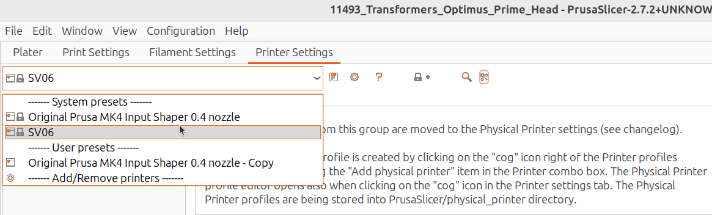
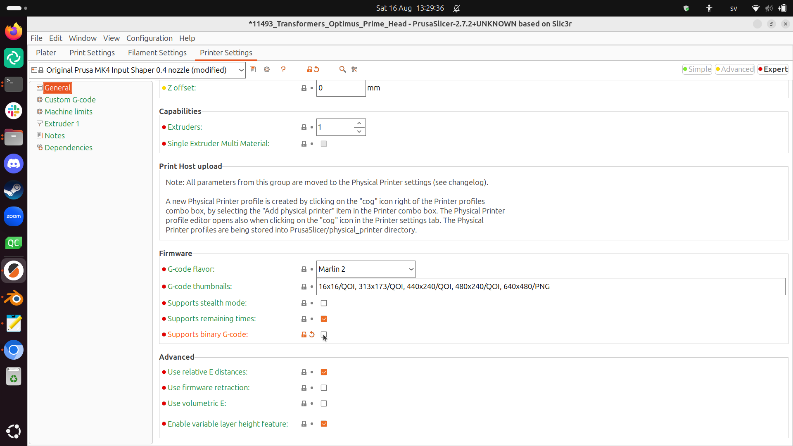
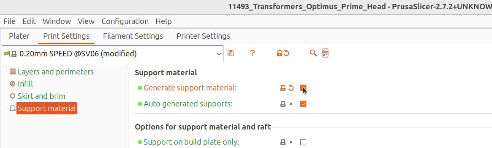
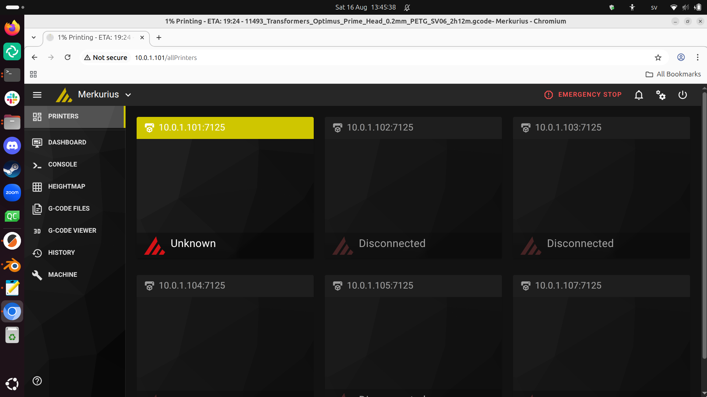

# optimus_prime

Reconstruction of Optimus Prime.

- [Blender model](11493_blend.zip) from [here](https://www.3dcadbrowser.com/3d-model/transformers-optimus-prime-head) by Tyler Johnson
- [Model](https://cults3d.com/en/3d-model/art/season-1-cartoon-head-for-er-optimus-prime)
- [UMS document](https://docs.google.com/document/d/19XWKK35NRPTLjWVb1oZWj3QDdvR7VoLGUCucDeBf9Bk/edit?tab=t.0#heading=h.2mj3xoab81u0)

## Worksflow

### 1. On your local computer, unzip the zip file

### 2. In Blender, export as STL

## 3. Setup PrusaSlicer

### 3.1 Select the SOVOL SV06 printer

### 3.2 Disable using binary GCode

### 3.3 Use auto-generated supports

### 3.4 Export to GCode

Must be a `.gcode` file. 

If it is a `.bgcode` file, it will not work
and you must do step 3.2 again.

## 4. In a webbrower, upload to printer

- Use the UMS WiFi
- Start a webbrowser
- Go to the URL of a printer

Printer  |URL
---------|-----------
Merkurius|10.0.1.101

You will the OctoPrint web interface:

Upload your files here.

## 5. In the printer, select 'Print' and then select your uploaded file

